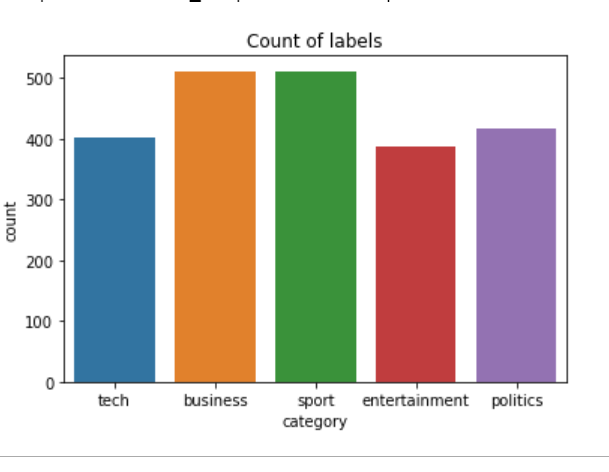
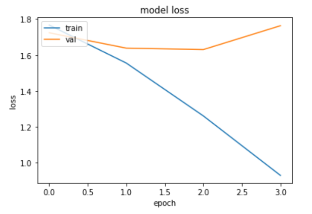
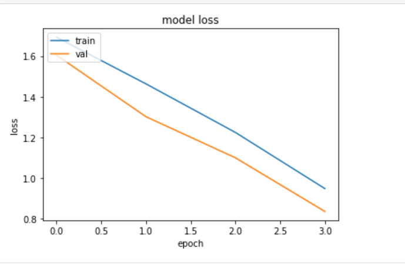

# Project Name :-
#### News Segment classification

### Project Intro/Objective :-
News information was not easily and quickly available until the beginning of last decade. But now news is easily accessible via content providers such as online news services.A huge amount of information exists in form of text in various diverse areas whose analysis can be beneficial in several areas.

Classification is quite a challenging field in text mining as it requires prepossessing steps to convert unstructured data to structured information. With the increase in the number of news it has got difficult for users to access news of his interest which makes it a necessity to categorize news so that it could be easily accessed.

News articles often fall under multiple topic labels.We’ll use a public dataset from the BBC comprised of 2225 articles, each labeled under one of 5 categories:  
- Business
- Entertainment
- Politics
- Sports 
- Tech

The goal will be to build a system that can accurately classify previously unseen news articles into the right category.

### Techniques  Used :-
- NLP: Using NLP techniques we will convert the text form of the data to vector form.
- RNN: For properly classifying the labels i.e which news belongs to which category we will use concept of RNN. 
    1. Simple RNN
    2. Bidirectional RNN
    3. LSTM

### Language Used :-
- Python 3.8

### Python Libarary used :-
- tensorflow
- NLTK
- scikit-learn
- pandas
- matplotlib
- seaborn
- numpy
- keras tuner

### Feature Engineering:

We will use concepts in NLP to performe below feature engineering on the text data. 

- Remove all the charectars that are non-alphabetical in nature
- Performe Lemmitization on the words.
- Remove all the stopwords

**Convert the Clean-Text into Vectors using Keras Onehot** 
The clean-text is in the text format , we need to convert it into numerical format or the vector format. 
One-hot encodes a text into a list of word indexes of size n. 
This function receives as input a string of text and returns a list of encoded integers each corresponding to a word (or token) in the given input string. 

**Padding on the List of word indexes** 
We are padding the input sequences so that they are aligned together. 
Padding can be a pre or a post, we are doing the post padding here, so if the given input sequence is less than the max_length we will pad the rest of places with 0. 

Convert the target categorical Labels to Numerical

| Target var    | Label      |
| ------------- |----------- |
| Sport         | 1          |
| Business      | 2          |
| Politics      | 3          |
| Tech          | 4          |
| Entertainement| 5          |

### EDA
We will see how the data is distributed in each class and whether we are having imbalance datasets or not.

From the Plot we can say that the data set is not imbalanced dataset.

### Model:
- Model 1: Baseline Model created using simple RNN technique
- Model 2: Created Bidirectional RNN with LSTM and tuned it using keras tuner

 
### Compare Loss function of Model 1 VS Model 2 by plot

**Plotting Loss for Model 1**

**Plotting Loss for Model 2**

Looking at the graphs we can tell that validation loss of Model2 is much better as compared to Model1.
The Loss in Model2 is gradually decreasing with each epoch , while thats not the case with the model1.

### Hyperparameter tuning:
We will use Keras tuner to tune Model 2 
- Method used :Random Search  
We will performe hyperparameter tuning of the Birectional RNN & LSTM with the help of keras tuner. 
Some of the Parameter that we will tune are:  
- Embedding Layer
- LSTM Layer
- Hidden layers
### Create a Keras Tuner Random search space

- max trail =3
- execution per trail =3

### Metrics
We will use precision to determine the model result.
We can clearly see that model 2 which was created using Bidirectional RNN and LSTM outperformed the baseline model in terms of precision score.

| Labels        | Model_1 Precision   | Model_2 Precision |
| ------------- |---------------------|-------------------|
| Sport         |0.53                 |0.93               |
| Business      |0.32                 |0.88               |
| Politics      |0.45                 |0.71               |
| Tech          |0.42                 |0.89               |
| Entertainement|0.14                 |0.89               |

